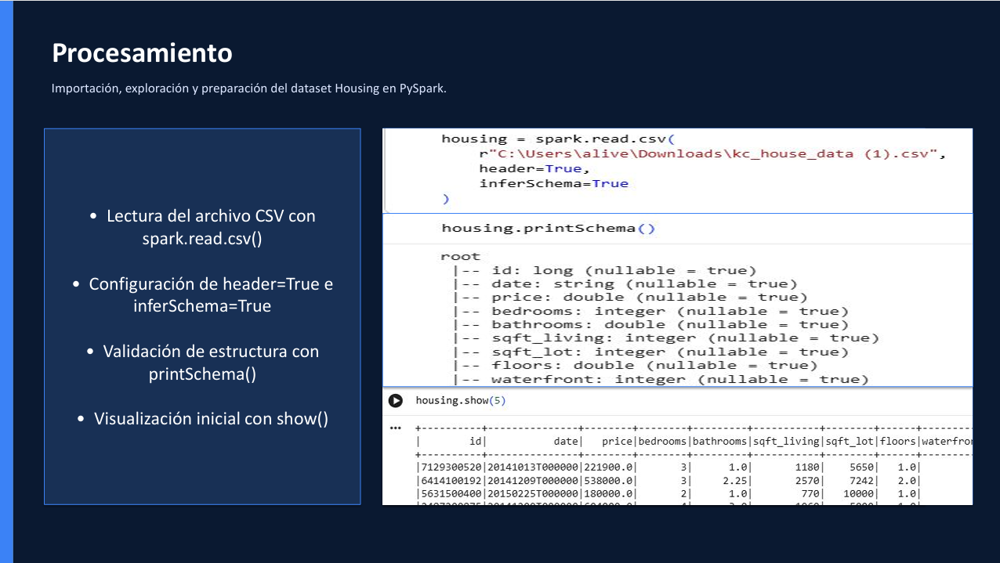
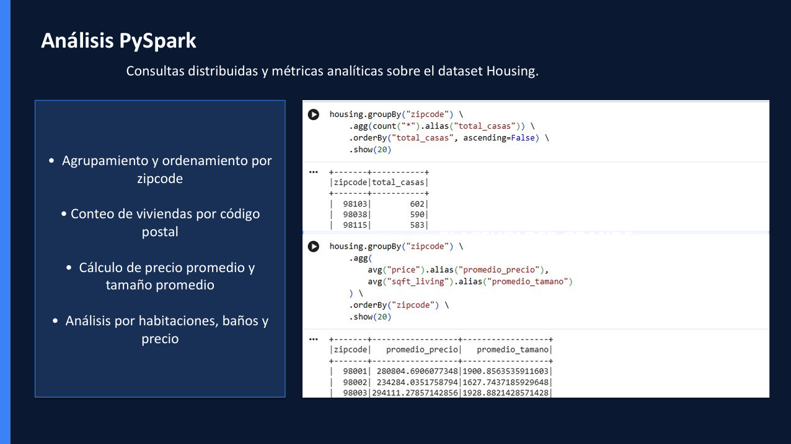
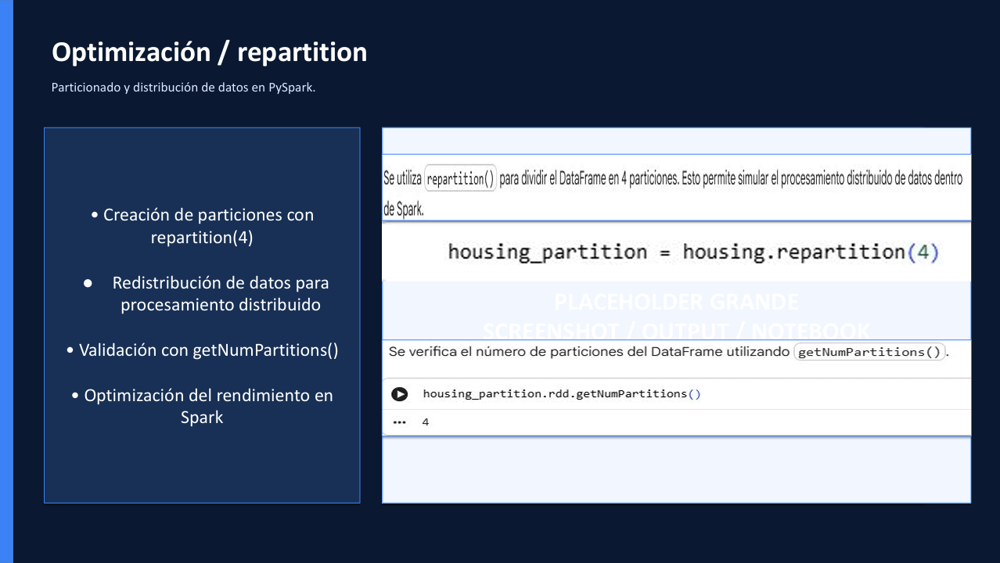

# 🔥 Big Data Analytics with PySpark

## Overview

This project demonstrates the implementation of Apache Spark and PySpark for distributed data processing, large-scale analytics, partitioning strategies, and performance optimization.

Using a housing market dataset, PySpark DataFrames and distributed computing techniques were applied to process data efficiently, generate analytical metrics, and explore how Spark manages large datasets through parallel execution.

---

## Business Problem

As organizations collect increasingly large volumes of data, traditional processing tools may become inefficient or difficult to scale.

Distributed computing frameworks such as Apache Spark allow data to be processed across multiple partitions, improving performance, scalability, and analytical capabilities.

### Business Question

How can distributed data processing techniques improve scalability, analytical performance, and efficiency when working with large datasets?

---

## Project Objectives

- Configure and initialize SparkSession using PySpark.
- Import and process housing market data with Spark DataFrames.
- Apply distributed transformations and aggregations.
- Generate analytical metrics using PySpark.
- Implement partitioning and optimization techniques.
- Explore distributed processing concepts in Apache Spark.

---

## Data Source

### Dataset

Housing market dataset containing residential property information, including:

- Property prices
- Bedrooms
- Bathrooms
- Living area
- Lot size
- Geographic information
- Zip codes

### Data Structure

- CSV format
- Structured tabular data
- Numerical and categorical variables
- Suitable for distributed processing analysis

---

## Tools & Technologies

- Python
- PySpark
- Apache Spark
- SparkSession
- Spark DataFrames
- Pandas
- Jupyter Notebook
- Git & GitHub

---

## Methodology

### 1. Spark Environment Configuration

A SparkSession was configured to initialize the Apache Spark environment and enable distributed data processing.

### 2. Data Import & Exploration

The housing dataset was imported using:

- spark.read.csv()
- header=True
- inferSchema=True

The dataset structure was validated through schema inspection and exploratory review.

### 3. Distributed Data Analysis

PySpark transformations and actions were applied to generate analytical insights using:

- groupBy()
- agg()
- avg()
- count()
- orderBy()

### 4. Aggregations and Metrics

Several analytical calculations were performed, including:

- Property count by zipcode
- Average property prices
- Average property size
- Geographic comparisons
- Housing distribution analysis

### 5. Data Partitioning & Optimization

The DataFrame was repartitioned to simulate distributed processing and improve workload distribution.

Techniques applied:

- repartition()
- getNumPartitions()

This step demonstrated Spark optimization fundamentals and scalability concepts.

---

## Key Findings

### Geographic Distribution Patterns

Certain zip codes concentrated a significantly higher number of residential properties than others.

### Property Price Differences

Average property prices varied considerably across geographic areas.

### Property Size Influence

Larger properties generally exhibited higher average market values, indicating a positive relationship between size and price.

### Distributed Processing Benefits

PySpark successfully executed analytical calculations through distributed operations, demonstrating scalability advantages over traditional local processing approaches.

---

## Visualizations & Technical Outputs

The following outputs summarize the distributed processing workflow, analytical operations, and Spark optimization techniques implemented throughout the project.

### Data Processing with Spark DataFrames

<p align="center">
  
</p>

### Distributed Analytics with PySpark

<p align="center">
  
</p>

### Spark Optimization & Repartitioning

<p align="center">
  
</p>

---

## Technical Impact

This project demonstrates:

- Distributed data processing concepts.
- Apache Spark fundamentals.
- PySpark DataFrame operations.
- Aggregations and analytical queries at scale.
- Data partitioning strategies.
- Performance optimization techniques.
- Scalable analytics workflows.

---

## Project Limitations

- The project uses a local Spark environment rather than a multi-node cluster.
- Dataset size is suitable for learning distributed concepts but does not represent enterprise-scale workloads.
- Advanced Spark features such as Spark Streaming and MLlib were not implemented.
- Cloud-based Spark environments were not included in this phase.

---

## Lessons Learned

Throughout this project, I strengthened my skills in:

- Apache Spark architecture.
- PySpark DataFrame operations.
- Distributed data processing concepts.
- Data partitioning techniques.
- Analytical aggregations using Spark.
- Performance optimization fundamentals.
- Big Data workflow design.

---

## Challenges

- Understanding Spark execution concepts.
- Managing distributed processing logic.
- Designing aggregation workflows using DataFrames.
- Implementing partitioning strategies.
- Interpreting analytical outputs generated through distributed operations.

---

## Recommendations

- Extend the project using larger datasets.
- Implement Spark SQL for more advanced querying.
- Explore Spark MLlib for machine learning applications.
- Deploy workloads in cloud-based Spark environments.
- Integrate Spark with modern Data Lake architectures.

---

## Conclusion

This project demonstrates how Apache Spark and PySpark can be used to process and analyze large datasets through distributed computing techniques. By applying DataFrame transformations, aggregations, partitioning, and optimization strategies, it was possible to generate analytical insights while strengthening practical knowledge of scalable Big Data processing.

---

## Repository Structure

```text
big-data-analytics-with-pyspark
├── README.md
├── notebooks
│   └── big-data-analytics-with-pyspark.ipynb
├── report
│   └── big-data-analytics-with-pyspark.pdf
└── Images
    ├── data-processing.png
    ├── pyspark-analysis.png
    └── spark-optimization.png
```

---

## Author

*Ali Vega*  
Data Analytics • Cloud Computing
